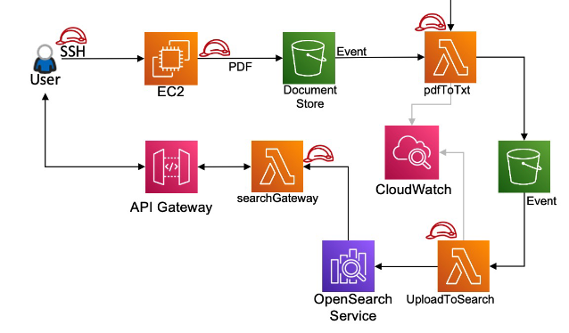

# AWS Search Engine Infrastructure

A serverless document search solution built with AWS services, using Infrastructure as Code (Terraform) to provision and manage all cloud resources.



## Architecture Overview

This solution implements a complete document ingestion, processing, and search pipeline using AWS serverless technologies:

### Components

1. **EC2 Uploader Instance**
   - User SSH access point
   - Uploads PDF documents to S3 Document Store
   - Configured with IAM role for S3 access

2. **S3 Document Store**
   - Primary storage for PDF documents
   - Triggers Lambda on PDF upload via S3 Event Notifications

3. **Lambda: pdftotxt**
   - Converts PDF documents to text format
   - Uses pypdf layer for PDF processing
   - Stores extracted text in S3 Intermediate bucket

4. **S3 Intermediate Store**
   - Temporary storage for extracted text files
   - Triggers upload-to-search Lambda on TXT creation

5. **Lambda: upload-to-search**
   - Indexes text documents into OpenSearch
   - Uses AWS SigV4 authentication
   - Includes metadata (title, author, date, body, summary)

6. **OpenSearch Service**
   - Full-text search engine
   - Fine-Grained Access Control (FGAC) enabled
   - VPC-isolated for security
   - Domain endpoint accessible only from Lambda and EC2

7. **API Gateway (HTTP API)**
   - Public-facing REST API
   - Routes:
     - `GET/POST /` → search-gateway Lambda (HTML UI)
     - `GET/POST /search` → searchFunction Lambda (JSON API)

8. **Lambda: search-gateway**
   - Serves HTML search interface
   - Interactive web UI with form submission

9. **Lambda: searchFunction**
   - Executes search queries against OpenSearch
   - Returns JSON results to frontend

10. **CloudWatch**
    - Centralized logging for all Lambda functions
    - Monitoring and troubleshooting

## Repository Structure

```
pgp-aws-services-devops-iac/
├── .gitignore                    # Excludes sensitive files and artifacts
├── README.md                     # This file
└── infra/
    ├── deploy.sh                 # Deployment wrapper script
    ├── .env                      # Environment variables (not in git)
    ├── versions.tf               # Terraform version constraints
    ├── providers.tf              # AWS provider configuration
    ├── variables.tf              # Input variables
    ├── locals.tf                 # Computed local values
    ├── iam.tf                    # IAM roles and policies
    ├── vpc.tf                    # VPC, subnets, NAT, security groups
    ├── s3.tf                     # S3 buckets and notifications
    ├── opensearch.tf             # OpenSearch domain and access policies
    ├── lambda.tf                 # Lambda functions and permissions
    ├── apigateway.tf             # API Gateway HTTP API
    ├── compute.tf                # EC2 uploader instance
    ├── bootstrap.tf              # OpenSearch FGAC bootstrap logic
    ├── outputs.tf                # Stack outputs
    └── lambdas/
        ├── pdftotxt/
        │   └── lambda_function.py
        ├── upload/
        │   └── lambda_function.py
        ├── gateway/
        │   ├── lambda_function.py
        │   └── search_page.py
        └── search/
            └── lambda_function.py
```

## Prerequisites

- **Terraform** >= 1.0
- **AWS CLI** configured with appropriate credentials
- **AWS Account** with sufficient permissions
- **SSH Key Pair** (for EC2 access)

## Setup Instructions

### 1. Create Environment File

Create an `.env` file in the `infra/` directory:

```bash
cd infra/
cat > .env << 'EOF'
# AWS Configuration
region=us-east-1
profile=your-aws-profile

# OpenSearch Master User Credentials
os_master_password=YourSecurePassword123!

# Optional: Custom S3 Bucket Names
# docstore_bucket_name=pgp-docstore
# intermediary_bucket_name=pgp-event

# Export Terraform Variables
export AWS_PROFILE=$profile
export TF_VAR_os_master_password=$os_master_password
export TF_VAR_region=$region
export TF_VAR_profile=$profile
EOF
```

**Important**: 
- Replace `your-aws-profile` with your AWS CLI profile name
- Set a strong password for `os_master_password` (used for OpenSearch master user)
- The `.env` file is ignored by git to prevent credential leaks

### 2. Initialize Terraform

```bash
./deploy.sh init
```

This command:
- Downloads required Terraform providers
- Initializes the backend
- Prepares the working directory

### 3. Review Infrastructure Plan

```bash
./deploy.sh plan
```

This command:
- Shows all resources that will be created
- Validates configuration syntax
- Estimates changes without applying them

### 4. Deploy Infrastructure

```bash
./deploy.sh apply
```

Or with auto-approval:

```bash
./deploy.sh apply -auto-approve
```

This command:
- Creates all AWS resources
- Takes 15-20 minutes (OpenSearch domain provisioning)
- Outputs important endpoints and resource names

### 5. Verify Deployment

After successful deployment, note the outputs:

```bash
terraform output
```

Key outputs:
- `api_gateway_url` - Public URL for search interface
- `docstore_bucket` - S3 bucket for PDF uploads
- `intermediate_bucket` - S3 bucket for text files
- `uploader_ec2_public_ip` - EC2 instance public IP
- `opensearch_endpoint` - OpenSearch domain endpoint (VPC-only)

## Deploy Script Usage

The `deploy.sh` script is a wrapper around Terraform that:
- Loads environment variables from `.env`
- Sets up Terraform workspaces (if needed)
- Executes Terraform commands with proper configuration

### Commands

```bash
# Initialize Terraform (first time setup)
./deploy.sh init

# Preview changes
./deploy.sh plan

# Apply changes
./deploy.sh apply

# Apply with auto-approval
./deploy.sh apply -auto-approve

# Target specific resources
./deploy.sh apply -target=aws_lambda_function.gateway

# Destroy all infrastructure
./deploy.sh destroy

# Pass additional Terraform flags
./deploy.sh plan -out=tfplan
./deploy.sh apply tfplan
```

### Help

Run without arguments to see usage:

```bash
./deploy.sh
# Output: Usage: ./deploy.sh {init|plan|apply|destroy} [extra args]
```

If `.env` is missing, it displays an example:

```bash
./deploy.sh init
# Output shows required .env format
```

## Usage

### Upload Documents

1. SSH into the EC2 instance:

```bash
ssh -i your-key.pem ec2-user@<uploader_ec2_public_ip>
```

2. Upload a PDF to the docstore bucket:

```bash
aws s3 cp document.pdf s3://<docstore_bucket>/
```

3. The pipeline automatically:
   - Converts PDF to text (pdftotxt Lambda)
   - Uploads to intermediate bucket
   - Indexes into OpenSearch (upload-to-search Lambda)

### Search Documents

Open the API Gateway URL in your browser:

```
https://<api-id>.execute-api.us-east-1.amazonaws.com/
```

- The homepage displays a search form
- Enter search terms and submit
- Results are fetched from OpenSearch and displayed

### API Endpoints

**HTML Search Interface**
```bash
curl https://<api-gateway-url>/
```

**JSON Search API**
```bash
curl -X POST https://<api-gateway-url>/search \
  -H "Content-Type: application/json" \
  -d '{"query": "search term"}'
```

## Infrastructure Details

### Networking

- **VPC**: 10.20.0.0/16
- **Public Subnets**: 10.20.0.0/24, 10.20.1.0/24 (2 AZs)
- **Private Subnets**: 10.20.10.0/24, 10.20.11.0/24 (2 AZs)
- **NAT Gateways**: One per public subnet
- **VPC Endpoint**: S3 Gateway endpoint for private subnet access

### Security

- **OpenSearch**: VPC-only access, FGAC enabled with master user
- **Lambda**: VPC-attached with security group egress to OpenSearch
- **EC2**: Public subnet with SSH access (configurable CIDR)
- **IAM**: Least-privilege roles with inline policies
- **Encryption**: At-rest (OpenSearch EBS, S3) and in-transit (HTTPS)

### Lambda Functions

| Function | Runtime | Memory | Timeout | Layers |
|----------|---------|--------|---------|--------|
| pdftotxt | Python 3.10 | 256 MB | 30s | layer-pypdf |
| upload-to-search | Python 3.9 | 256 MB | 60s | aws_auth |
| search-gateway | Python 3.9 | 256 MB | 30s | - |
| searchFunction | Python 3.11 | 256 MB | 60s | aws_auth |

### OpenSearch Configuration

- **Instance Type**: t3.small.search
- **Instance Count**: 1
- **EBS Volume**: 20 GB gp3
- **Engine**: OpenSearch 2.11
- **Access Control**: Fine-Grained Access Control (FGAC)
- **Authentication**: Internal user database with master user
- **Index**: `documents`

### Cost Estimation

Monthly costs (approximate, us-east-1):

- OpenSearch t3.small: ~$45
- NAT Gateways (2): ~$65
- EC2 t3.micro: ~$8
- Lambda (low volume): ~$1
- S3 (10 GB): ~$0.25
- API Gateway (1M requests): ~$1

**Total**: ~$120/month

## Troubleshooting

### OpenSearch Access Denied (403)

If Lambdas receive 403 errors when indexing:

1. SSH into EC2 instance
2. Run FGAC role mapping:

```bash
ENDPOINT="vpc-pgp-search-dev-xxx.us-east-1.es.amazonaws.com"
MASTER_USER="master-user"
MASTER_PASS="your-password"
LAMBDA_ROLE="arn:aws:iam::ACCOUNT:role/pgp-searchengine-lambda-exec-role"

curl -sk -u "$MASTER_USER:$MASTER_PASS" \
  -H 'Content-Type: application/json' \
  -X PUT "https://$ENDPOINT/_plugins/_security/api/rolesmapping/all_access" \
  -d "{\"backend_roles\":[\"$LAMBDA_ROLE\"]}"
```

### Lambda VPC Timeout

If Lambdas timeout accessing OpenSearch:

- Verify security group rules allow Lambda → OpenSearch (port 443)
- Check NAT Gateway is active in the private subnet route table
- Ensure Lambda is attached to private subnets

### PDF Conversion Fails

- Check CloudWatch logs: `/aws/lambda/pgp-pdftotxt`
- Verify pypdf layer ARN is correct for your region
- Ensure Lambda has sufficient memory (256 MB)

## Cleanup

To destroy all resources:

```bash
./deploy.sh destroy
```

Confirm with `yes` when prompted.

**Note**: S3 buckets must be empty before destruction. If you encounter errors, manually empty the buckets:

```bash
aws s3 rm s3://<docstore_bucket> --recursive
aws s3 rm s3://<intermediate_bucket> --recursive
./deploy.sh destroy
```

## Security Best Practices

1. **Credentials**: Never commit `.env` or `.tfvars` files
2. **SSH Access**: Restrict `allowed_ssh_cidr` to your IP in `variables.tf`
3. **OpenSearch**: Use strong master password (min 12 chars, mixed case, symbols)
4. **IAM**: Review and tighten broad test policies before production
5. **Logging**: Enable CloudWatch Logs retention and alerting
6. **Backups**: Configure automated OpenSearch snapshots to S3

## Contributing

This is a demonstration project. For production use:

- Implement least-privilege IAM policies
- Add WAF rules to API Gateway
- Enable VPC Flow Logs
- Set up CloudWatch Alarms
- Implement backup and disaster recovery
- Add CI/CD pipeline for Lambda deployments

## License

This project is provided as-is for educational purposes.

## Architecture Diagram

The architecture diagram above illustrates the complete data flow:

1. User uploads PDF via SSH to EC2
2. EC2 puts PDF into S3 Document Store
3. S3 Event triggers pdftotxt Lambda
4. Text extraction writes to S3 Intermediate bucket
5. S3 Event triggers upload-to-search Lambda
6. Document indexed into OpenSearch Service
7. User accesses search UI via API Gateway
8. API Gateway routes to search-gateway Lambda (UI) or searchFunction Lambda (API)
9. Lambda queries OpenSearch and returns results
10. CloudWatch monitors all Lambda executions

---

**Project**: AWS Search Engine Infrastructure  
**Stack**: Terraform + AWS Lambda + OpenSearch + S3 + API Gateway  
**Last Updated**: November 2025
